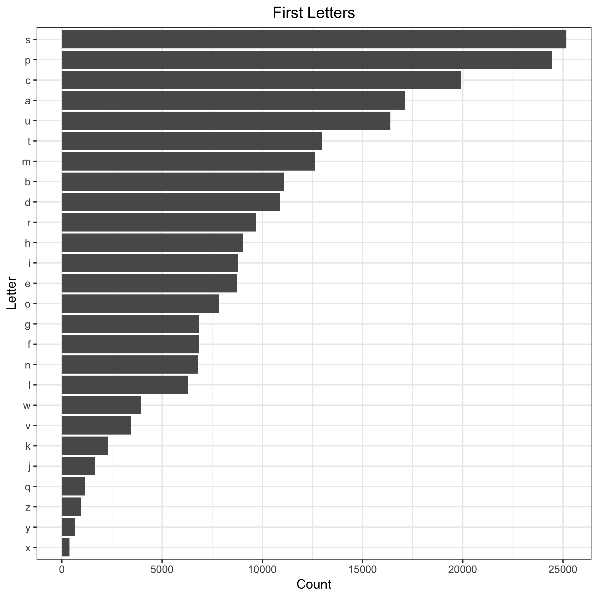
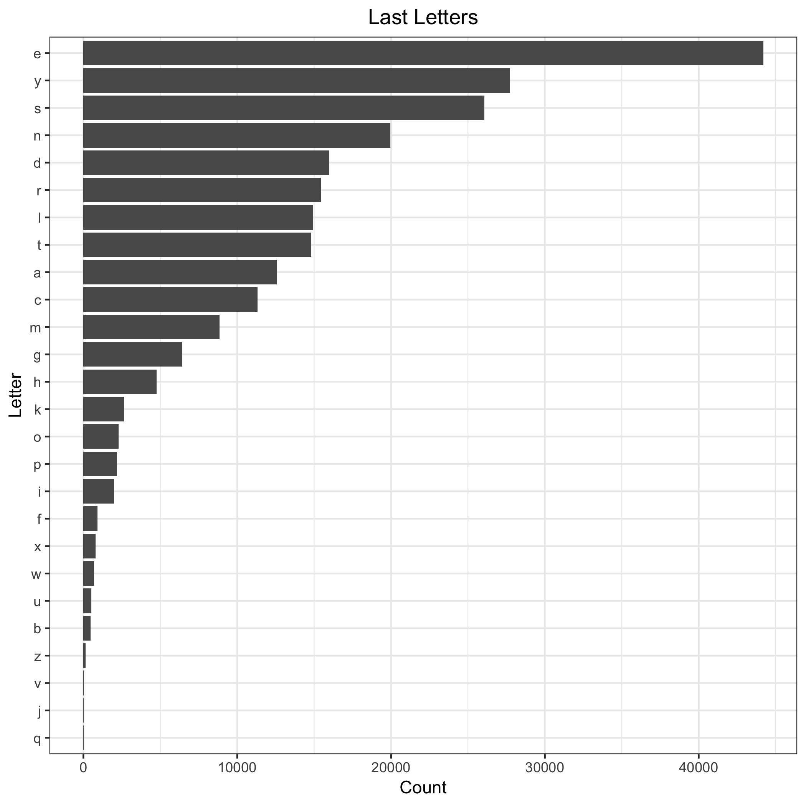
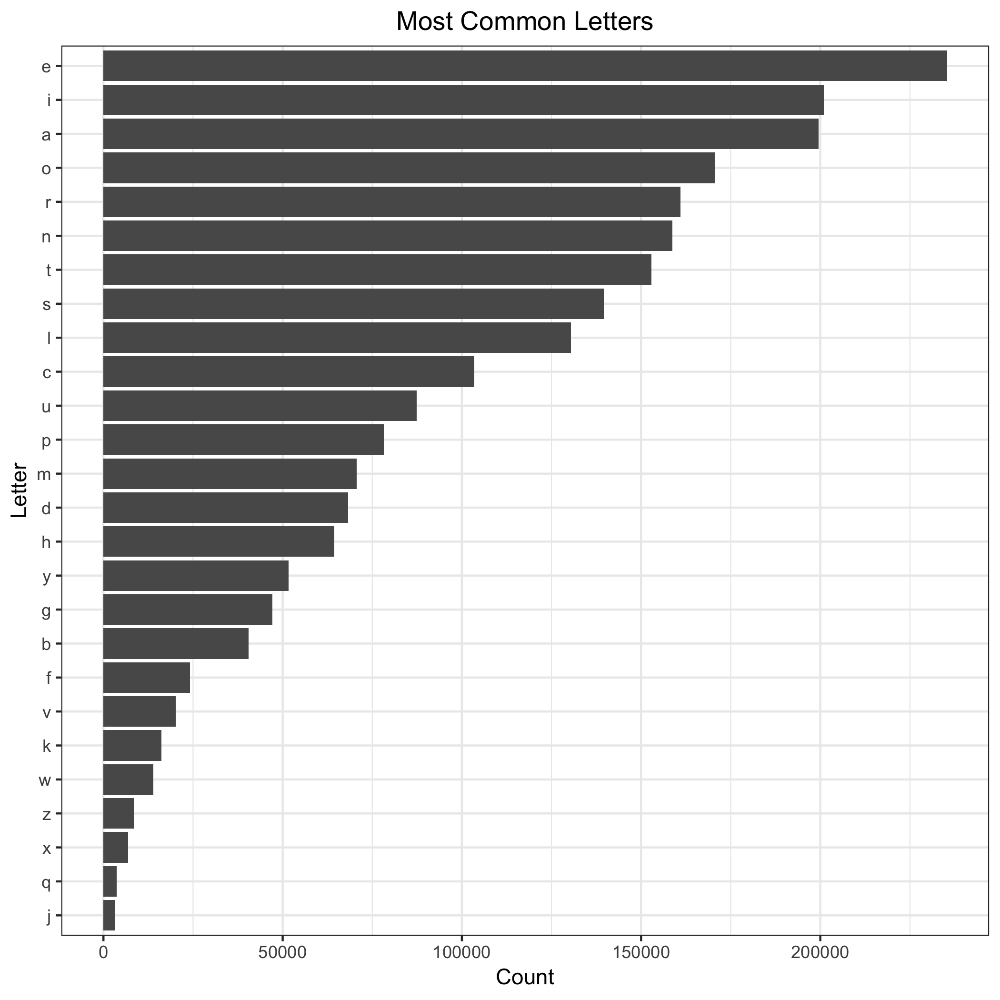

```{r setup, include=FALSE}
knitr::opts_chunk$set(echo = TRUE, message = FALSE, warning = FALSE, fig.align = 'center')
```

This is a repository for Homework 09 by Roger Yu-Hsiang Lo. For the instruction of the homework, please see [here](http://stat545.com/Classroom/assignments/hw09/hw09.html).

## Files

I added three other simple analyses and one [`README.Rmd`](README.Rmd) file, which generates this `README.md`, to the original [pipeline](https://github.com/STAT545-UBC/make-activity). The added `.R` scripts are [`first.R`](first.R), [`last.R`](last.R), and [`common.R`](common.R), each of which also generates a plot (shown below). The modified `Makefile` can be accessed through [here](Makefile).

The three analyses are summarized below.

## Most frequent first letters in English words

The code used to carry out the analysis and produce the plot can be found [here](first.R). The results are summarized in the following plot:



It is clear from the plot that far more words start with letters **s** or **p** than with **y** or **x**.

## Most frequent last letters in English words

We can have a similar analysis for the *last* letter of words. The code for this analysis can be found [here](last.R).



As can be seen from the plot, a lot of words end in **e** while only very few words end in **j** or **q**.

## Most common letters in English words

Finally we can look at how common each letter is across words. The code used for analysis and plot can be found [here](common.R). Here are the results:



Notice that the top four letters are all vowels: **e**, **i**, **a**, and **o**. **j** and **q** again are at the bottom of the list.

From the results above, we can conclude that

> All letters are equal, but some letters are more equal than others